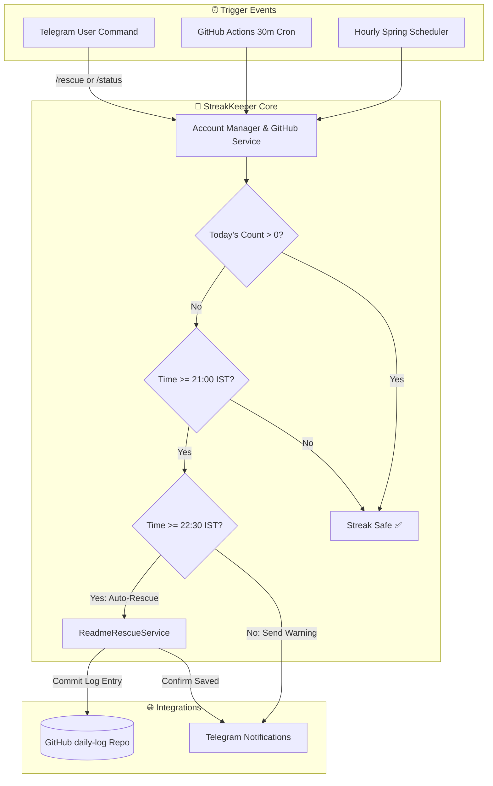

# 🔥 StreakKeeper

<div align="center">


**A self-hosted GitHub contribution guardian that keeps your contribution graph green — with automatic alerts, auto-rescue commits, and full Telegram remote control.**

*Never lose a GitHub streak again.*

</div>

---

## ✨ Features

| Feature | Description |
| :--- | :--- |
| 📊 **Contribution Tracking** | Fetches real-time daily contribution counts via GitHub GraphQL API (today + full 365-day calendar). |
| 🔥 **Streak Alerts** | Sends an urgent Telegram alert at **21:00 IST** if today's count is still `0`. |
| 🤖 **Auto-Rescue** | At **22:30 IST**, automatically commits a daily log entry to your rescue repo — streak saved! |
| 👥 **Multi-Account** | Protects multiple GitHub accounts simultaneously, each with dedicated tokens and rescue repos. |
| 💬 **Telegram Remote Control** | Control everything from your phone: `/status`, `/rescue`, `/accounts`, `/account <name>`, `/help`. |
| 📈 **Streak Analytics** | Calculates current streak, longest streak, and annual totals over a 365-day rolling window. |
| ⏰ **24/7 Guardian Mode** | Backup GitHub Actions workflow runs every 30 minutes — works even with your laptop powered off. |

---

## 🏗️ Architecture

StreakKeeper operates with a dual-layer architecture: a full-featured **Spring Boot Engine** for local or cloud hosting, complemented by a lightweight **GitHub Actions Guardian Layer** for 24/7 serverless resilience.

```
┌─────────────────────────────────────────────────────────────────────────┐
│                           STREAKKEEPER ENGINE                           │
│                          (Spring Boot / Kotlin)                         │
├────────────────────────────────┬────────────────────────────────────────┤
│  ⏰ StreakScheduler             │  💬 TelegramCommandService              │
│  • Hourly Cron Check (0 0 * * *)│  • 30s Polling (/getUpdates)           │
│  • 21:00 Alert (Risk Warning)  │  • Remote Commands: /status, /rescue   │
│  • 22:30 Auto-Rescue Commit    │  • Multi-Account Switcher (/account)   │
├────────────────────────────────┴────────────────────────────────────────┤
│  🛡️ ReadmeRescueService         │  👥 AccountManagerService              │
│  • Base64 Read & Append        │  • Multi-token Registry & Discovery    │
│  • 409 Conflict Safe Retries   │  • GraphQL Viewer Account Validator    │
└───────────────────┬─────────────────────────────────┬───────────────────┘
                    │                                 │
     GraphQL & REST │                                 │ Telegram Bot API
                    ▼                                 ▼
       ┌────────────────────────┐        ┌─────────────────────────┐
       │     GITHUB PLATFORM    │        │      TELEGRAM APP       │
       │  • GraphQL Contributions│◄───────┤  • Interactive Chat     │
       │  • daily-log Repository│ (User) │  • Instant Push Alerts  │
       └────────────────────────┘        └─────────────────────────┘
                    ▲
                    │ 24/7 Backup Guardian (Serverless Cron)
       ┌────────────┴───────────┐
       │ GITHUB ACTIONS RUNNER  │
       │ • guardian.yml (*/30)  │
       │ • Runs laptop-off      │
       └────────────────────────┘
```

### Flow Diagram



---

## 🛠️ Tech Stack

- **Backend:** Kotlin 2.0 · Spring Boot 3.3 · Java 21 · Gradle Kotlin DSL
- **APIs:** GitHub GraphQL API · GitHub REST Contents API · Telegram Bot API
- **Automation:** GitHub Actions (cron scheduling & CI/CD)
- **Notifications:** Telegram Instant Messenger

---

## 🚀 Getting Started

### Prerequisites
- **JDK 21** installed
- **Git**
- A **Telegram** account
- GitHub **Personal Access Token(s)**

---

### 1. Create the Rescue Repository
For each GitHub account you want to protect:
1. Create a new public repository named **`daily-log`** (must **not** be a fork).
2. Check **"Add a README file"** ✅.

> [!IMPORTANT]
> GitHub only records contributions to repositories you own when commits are pushed directly to the default branch (`main`).

---

### 2. Generate GitHub Personal Access Token (PAT)
1. Go to **GitHub Settings** $\rightarrow$ **Developer Settings** $\rightarrow$ **Personal access tokens** $\rightarrow$ **Tokens (classic)**.
2. Click **Generate new token (classic)**.
3. Expiration: `No expiration` (or 90 days).
4. Scopes: Select `repo` (Full control of private/public repositories) and `read:user`.
5. Repeat for each account you wish to protect.

> [!TIP]
> Verify token ownership in your terminal:
> ```bash
> curl -H "Authorization: bearer YOUR_TOKEN" https://api.github.com/user
> ```

---

### 3. Create the Telegram Bot
1. Open Telegram and search for [@BotFather](https://t.me/BotFather).
2. Send `/newbot`, choose a name and username, then copy your **Bot API Token**.
3. Send a message to your newly created bot (press **Start**).
4. Message [@userinfobot](https://t.me/userinfobot) to get your numeric **Telegram Chat ID**.
5. Test your bot in the browser:
   ```text
   https://api.telegram.org/bot<YOUR_BOT_TOKEN>/sendMessage?chat_id=<YOUR_CHAT_ID>&text=Hello+from+StreakKeeper
   ```

---

### 4. Configure & Run Locally

Clone the repository:
```powershell
git clone https://github.com/Nimmanagotitharunkumarhello/github-agent-fun-.git
cd "github-agent-fun-"
```

Set your environment variables:

#### Windows PowerShell:
```powershell
$env:MAIN_GH_TOKEN="ghp_main_account_token"
$env:PERSONAL_GH_TOKEN="ghp_second_account_token"
$env:TELEGRAM_BOT_TOKEN="123456:ABC-DEF1234ghIkl-zyx57W2v1u123ew11"
$env:TELEGRAM_CHAT_ID="123456789"
$env:GITHUB_OWNER="hackerrrarccc-sys"
$env:GITHUB_OWNER_2="Nimmanagotitharunkumarhello"

.\gradlew.bat bootRun
```

#### Linux / macOS:
```bash
export MAIN_GH_TOKEN="ghp_main_account_token"
export PERSONAL_GH_TOKEN="ghp_second_account_token"
export TELEGRAM_BOT_TOKEN="123456:ABC-DEF1234ghIkl-zyx57W2v1u123ew11"
export TELEGRAM_CHAT_ID="123456789"
export GITHUB_OWNER="hackerrrarccc-sys"
export GITHUB_OWNER_2="Nimmanagotitharunkumarhello"

chmod +x gradlew
./gradlew bootRun
```

---

### 5. Verification

- **Console Output:** Look for `TelegramCommandService active! Polling for authorized chat_id: ...`
- **Health Check:** `http://localhost:8080/health` $\rightarrow$ `{"status":"UP"}`
- **Contribution Stats:** `http://localhost:8080/stats` $\rightarrow$ 365-day calendar array + streaks
- **Telegram Bot:** Send `/status` to receive real-time stats directly on your phone!

---

## 🤖 24/7 Guardian Mode (GitHub Actions)

StreakKeeper includes a built-in serverless guardian workflow (`.github/workflows/guardian.yml`) that executes on GitHub's cloud infrastructure every 30 minutes.

### Guardian Schedule (Asia/Kolkata):
| Time (IST) | Condition | Action Taken |
| :--- | :--- | :--- |
| **21:00 – 22:29** | Today's count = `0` | 🔥 Telegram warning alert sent |
| **22:30+** | Today's count = `0` | 🤖 Auto-commits rescue log entry to `daily-log/README.md` |

### Required Repository Secrets
In your GitHub repo, navigate to **Settings** $\rightarrow$ **Secrets and variables** $\rightarrow$ **Actions** and add:

| Secret Name | Value Description |
| :--- | :--- |
| `MAIN_GH_TOKEN` | Personal Access Token for the primary GitHub account |
| `PERSONAL_GH_TOKEN` | Personal Access Token for the secondary GitHub account |
| `TELEGRAM_BOT_TOKEN` | Bot API Token generated from @BotFather |
| `TELEGRAM_CHAT_ID` | Your authorized Telegram numeric Chat ID |

---

## 💬 Telegram Commands

| Command | Description | Example Response |
| :--- | :--- | :--- |
| `/status` | Shows today's contributions & streaks for active account | `🔥 @hackerrrarccc-sys: 3 contributions today!` |
| `/rescue` | Manually triggers an instant rescue commit | `🤖 Rescue committed: Added daily log entry ✅` |
| `/accounts` | Lists all registered accounts and their live status | `👥 Accounts: [1] @hackerrrarccc-sys (active), [2] @user2` |
| `/account <name>` | Switches the active account | `Switched to 'second' → @Nimmanagotitharunkumarhello ✅` |
| `/help` | Displays command list and usage | `List of available commands...` |

---

## ⚙️ Configuration Reference

All settings can be configured via environment variables or `application.yml`:

| Environment Variable | Default | Description |
| :--- | :--- | :--- |
| `TIMEZONE` | `Asia/Kolkata` | Timezone for alert & rescue schedules |
| `ALERT_TIME` | `21:00` | Time to trigger warning notification |
| `RESCUE_TIME` | `22:30` | Time to perform automated rescue commit |
| `GITHUB_RESCUE_REPO` | `daily-log` | Default repository to commit rescue logs |
| `PORT` | `8080` | Spring Boot HTTP server port |

---

## 🩺 Troubleshooting Guide

| Issue | Root Cause | Solution |
| :--- | :--- | :--- |
| **`404 Not Found` on Telegram API** | Bot token is missing the `bot` prefix or was revoked. | Verify URL format: `https://api.telegram.org/bot<TOKEN>/sendMessage`. |
| **`getUpdates` returns `{"result":[]}`** | Bot updates already consumed or no message sent yet. | Open Telegram, search for your bot, and send `/start`. |
| **Port `8080` already in use** | A previous instance is still running in the background. | `netstat -ano \| findstr :8080` $\rightarrow$ `taskkill /PID <PID> /F`. |
| **`403 Resource not accessible`** | Fine-grained token missing write permissions. | In PAT settings, set **Repository Permissions** $\rightarrow$ **Contents: Read & Write**. |
| **Rescue committed but graph stays gray** | Target repository is private or commit not on default branch. | Ensure `daily-log` is **Public** and commits target `main`. |
| **`exit code 126` in GitHub Actions** | `gradlew` script does not have execute permissions. | Run `git update-index --chmod=+x gradlew` and push. |
| **`ClassNotFoundException: GradleWrapperMain`** | `gradle-wrapper.jar` was omitted from the repo. | Run `git add -f gradle/wrapper/gradle-wrapper.jar` and commit. |
| **Telegram `409 Conflict`** | Two applications polling `/getUpdates` simultaneously. | Ensure only ONE poller is active (local app or cloud poller). |

---

## 🔒 Security Best Practices

- **Zero Hardcoded Secrets:** All tokens and credentials are read strictly from environment variables or GitHub Encrypted Secrets.
- **Authorized Sender Verification:** Telegram commands reject any message not originating from your specified `TELEGRAM_CHAT_ID`.
- **Immediate Revocation:** If a token is ever exposed in logs or screenshots, revoke it immediately via GitHub / BotFather.

---

## 🗺️ Future Roadmap & Upcoming Issues

Here is the structured backlog of what is being built next from this foundation:

### 🌟 Level 1 — Extend StreakKeeper (Same Codebase)
| Upcoming Feature / Issue | Effort | What You'll Learn / Tech |
| :--- | :---: | :--- |
| 📱 **Android App (Heatmap + Cards)** | `Medium` | Kotlin + Jetpack Compose + Firebase sync for real-time streak cards and mobile contribution grid. |
| 🔔 **FCM Native Push Notifications** | `Medium` | Migrate/augment Telegram with direct Firebase Cloud Messaging to mobile devices. |
| 🎮 **Developer XP System** | `Easy` | Points & leveling math awarded per daily commit, streak length, and PR merged. |
| 🌐 **Web Dashboard** | `Easy` | Modern responsive frontend consuming the live `/stats` 365-day JSON endpoint. |
| ☁️ **Oracle Cloud Free VM Deploy** | `Medium` | Persistent 24/7 background service for instantaneous `/status` Telegram command processing. |

### 🔄 Level 2 — Sibling Projects (Reusing ~70% Architecture)
| Project | Reuses From StreakKeeper |
| :--- | :--- |
| 🐕 **Repo Watchdog** | GitHub Webhooks/REST API + Telegram alert dispatching when repositories receive stars/forks/issues. |
| 📰 **Commit Journal Bot** | GraphQL contribution collection + daily automated digest posted to Telegram summarizing code written. |
| 🧩 **LeetCode + GitHub Dual Streak Tracker** | Scheduler & rescue pattern extended to track competitive programming consistency alongside GitHub. |
| 🏆 **Team Leaderboard Edition** | Multi-account registry expanded to track friend groups or teams with competitive streak ranking. |

### 🤖 Level 3 — The Autonomous AI Agent
```text
Phase 2–4: AI agent that reads repository issues → resolves TODOs → creates pull requests.
Phase 7:   Autonomous scheduled TODO-hunting bot.
```

---

## ⚖️ Copyright & Intellectual Property Notice

```text
Copyright (c) 2026 Nimmanagoti Tharun Kumar. All Rights Reserved.
```

- **Original Author:** Nimmanagoti Tharun Kumar ([@Nimmanagotitharunkumarhello](https://github.com/Nimmanagotitharunkumarhello))
- **Source Code Integrity:** This repository, architecture, and documentation are protected by applicable copyright and intellectual property laws.
- **Fair Use & Licensing:** Distributed under the terms of the [MIT License](LICENSE). Unauthorized commercial rebranding, trademark infringement, or uncredited re-distribution of proprietary assets is strictly prohibited and subject to copyright enforcement / DMCA action.

---

## 📄 License

This project is open-sourced under the **MIT License** — see the [LICENSE](LICENSE) file for complete legal details.

<div align="center">
Built with ☕, Kotlin, and a lot of green squares. 🟩
</div>

